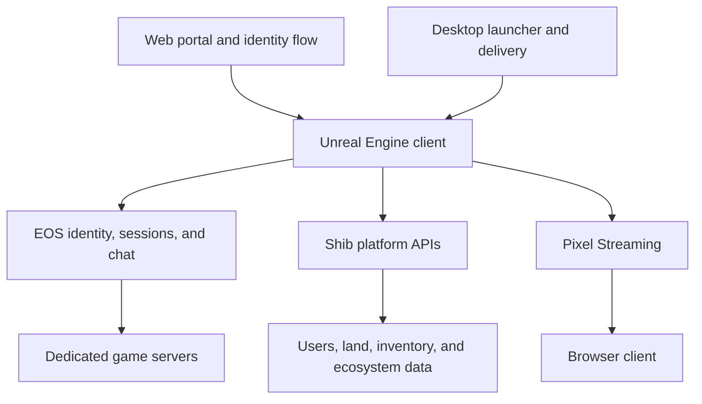

# Shib: The Metaverse

  

  <strong>A large-scale multiplayer world built in Unreal Engine 5, spanning dedicated servers, social systems, digital identity, land, avatars, minigames, and cloud streaming.</strong>

Shib: The Metaverse is a persistent online world designed for social interaction, exploration, player-owned land, and connected digital assets. The project combines a high-fidelity Unreal client with multiplayer services, a custom launcher, web authentication, backend APIs, and Pixel Streaming delivery.

See the environments and wider production story in the [Rebel Art Studios case study](https://rebelartstudios.org/project/shib-the-metaverse). The case study covers the complete program, including its large dedicated-server deployment; this repository focuses on selected Unreal Engine source modules and configuration.

## Visual showcase

  
  

  

## Engineering scope

- Networked third-person world with client, editor, game, and dedicated-server targets
- Epic Online Services authentication, account linking, matchmaking, sessions, and game chat
- Persistent player inventory, item tiers, vendors, and replicated world interactions
- Land and plot systems connected to metaverse API data
- In-world construction tools with build actors, placement controls, persistence, and history
- Modular avatar assembly, customization UI, animation, save data, and command history
- Replicated fishing and archery minigames with reusable gameplay components
- Pixel Streaming support for browser-based access to the Unreal experience
- Runtime chunk downloading, asynchronous loading screens, and cross-platform configuration
- Water, buoyancy, PCG, motion matching, and Unreal's large-world rendering toolset

## Platform architecture

## Technology

- Unreal Engine 5.4 and C++
- Blueprint-facing gameplay and UI extension points
- Redpoint EOS, Online Subsystem Blueprints, and matchmaking integrations
- Pixel Streaming
- Enhanced Input, UMG, Slate, HTTP, JSON, and runtime settings
- Water, Buoyancy, PCG, Pose Search, Motion Trajectory, and Movie Render Pipeline
- Windows, Linux, Linux ARM64, macOS, iOS, Android, and tvOS configuration

## Repository map

| Path | Responsibility |
| --- | --- |
| `Source/ShibMVMain/` | Characters, players, chat, inventory, plots, streams, minigames, UI, and world actors |
| `Plugins/ShibMultiplayer/` | EOS identity, cross-platform accounts, sessions, matchmaking, and chat |
| `Plugins/ShibAvatarBuilder/` | Avatar assembly, customization operations, animation, UI, and persistence |
| `Plugins/ShibPlotBuilder/` | Player construction, placement tools, build history, and save data |
| `Plugins/ShibAPIs/` | Metaverse, tournament, payment, and connected game API clients |
| `Plugins/ShibChunkingSystem/` | Runtime content delivery through Unreal's chunk downloader |
| `Plugins/ShibAsyncLoadingScreen/` | Startup and in-session loading experiences |
| `Plugins/ShibUiNavigation/` | Shared page navigation and save subsystems |
| `Config/` | Engine, platform, input, server, and Pixel Streaming configuration |

## Repository scope

This is a source-code and architecture showcase, not a complete production distribution. Proprietary `Content/`, environment assets, service credentials, infrastructure definitions, and licensed third-party plugins are intentionally absent. A fresh clone cannot open as the full experience without the private project dependencies.

Authorized contributors need Unreal Engine 5.4, a compatible native toolchain, the private content depot, production-safe service configuration, and the external plugins declared in `ShibMVMain.uproject`. Once restored, generate project files, build `ShibMVMainEditor`, and select the appropriate client or server target for the intended deployment.

## Connected repositories

- [LapDogs](https://github.com/Elia-Youssef/LapDogs) - multiplayer racing title built on related ecosystem services
- [ShibPortal-Desktop](https://github.com/Elia-Youssef/ShibPortal-Desktop) - desktop library, delivery, settings, and launch orchestration
- `ShibPortal-Frontend` - private browser identity and streaming-session bridge
- `Shib-Backend` - private platform APIs for identity, games, land, NFTs, and sessions

## Ownership and licensing

Copyright notices in the source identify Shiba Inu Games LLC. No open-source license is included. Unless a separate agreement grants permission, the source is provided for viewing and portfolio reference only.
